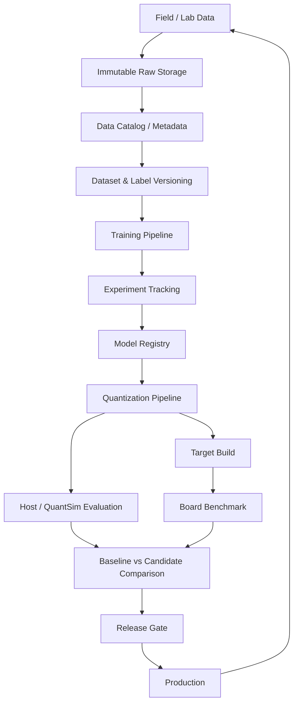
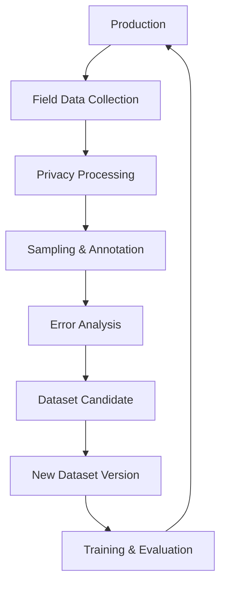
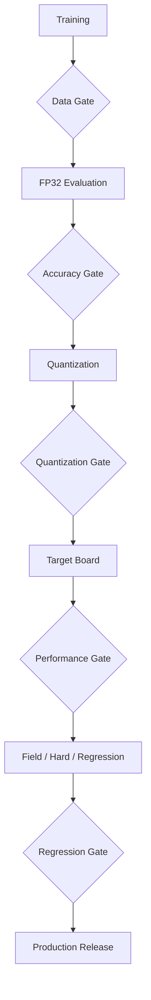
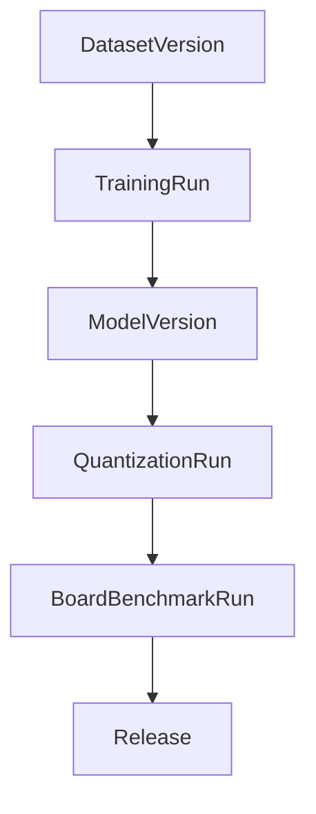

# On-device Vision AI 학습·데이터·모델 Lifecycle 관리 시스템 개발 계획

## 1. 목적

On-device Vision AI 상용화 과정에서는 신규 이미지와 클래스 추가, 클래스 세분화·통합, 모델 구조 변경, 필드 데이터 평가, 양자화 설정 변경, 실제 보드 성능 검증 등이 반복된다.

단순히 `model_v1.onnx`, `model_final.onnx`처럼 파일만 관리하면 성능 변화의 원인을 추적하기 어렵다. 따라서 본 시스템은 다음 질문에 답할 수 있어야 한다.

- 이 모델은 어떤 데이터와 클래스 정의로 학습되었는가?
- 어떤 코드, 파라미터, 전처리, Loss로 학습되었는가?
- 어떤 평가 세트와 Calibration Set을 사용했는가?
- FP32, INT8, INT16의 정확도 차이는 얼마인가?
- QuantSim과 실제 Target Board 결과의 차이는 얼마인가?
- 현재 양산 모델 대비 어떤 클래스가 개선되거나 악화되었는가?
- 최종 모델이 어떤 과정을 거쳐 Production으로 승인되었는가?

핵심 목표는 아래 전체 흐름을 하나의 lineage로 연결하는 것이다.

```text
Data → Dataset → Training → Model → Quantization
     → Target Board → Field Evaluation → Release
```

---

## 2. 전체 시스템 Architecture



관리 대상은 다음과 같다.

| 계층 | 주요 관리 객체 |
|---|---|
| Data | Raw image/video, metadata, annotation, privacy status |
| Dataset | Dataset version, label schema, split, evaluation set, calibration set |
| Training | Code commit, config, seed, metrics, artifacts |
| Model | FP32 model, preprocessing, label mapping, model registry state |
| Quantization | Method, precision, PCQ, clipping, encodings, calibration data |
| Target | Board, OS, firmware, runtime, accelerator, conversion settings |
| Evaluation | Accuracy, per-class metrics, confusion, latency, memory, power |
| Release | Baseline comparison, gate result, approver, production alias |

---

## 3. 핵심 설계 원칙

### 3.1 모든 작업을 고유 Run ID로 추적

학습, 평가, 양자화, 보드 테스트에 각각 고유 ID를 부여한다.

```text
TRAIN-20260916-00123
EVAL-20260916-00284
QUANT-20260916-00412
BOARD-20260916-00081
```

모든 결과는 다음 관계를 따라 역추적할 수 있어야 한다.

```text
Dataset Version
  └─ Training Run
      └─ FP32 Model Version
          └─ Quantization Run
              └─ Quantized Model
                  └─ Board Benchmark Run
                      └─ Production Release
```

### 3.2 Immutable Snapshot

- Raw Data 원본은 가능한 한 수정하지 않는다.
- 생성된 Dataset Version은 수정하지 않고 새 버전을 만든다.
- Evaluation Set과 Calibration Set도 독립적인 immutable version으로 관리한다.
- 결과를 재생성할 수 있도록 코드, 환경, 설정, seed를 저장한다.

### 3.3 모델 파일보다 Run을 중심으로 관리

모델 파일은 하나의 artifact다. 실험의 실제 identity는 입력 데이터, 코드, 설정, 환경, 결과를 포함하는 `Training Run` 또는 `Quantization Run`이다.

### 3.4 공통 평가기를 통한 공정한 비교

모든 Baseline과 Candidate는 동일한 evaluator와 동일한 evaluation set으로 비교한다. Global accuracy뿐 아니라 per-class 성능과 회귀를 함께 확인한다.

---

## 4. 데이터 관리 체계

최소한 다음 객체를 분리해서 관리한다.

| 객체 | 역할 |
|---|---|
| Raw Data | 수정하지 않는 원본 이미지·영상 |
| Data Asset | 고유 ID와 metadata를 가진 개별 데이터 |
| Dataset Version | 특정 시점의 학습 가능 데이터 snapshot |
| Label Schema Version | 클래스 정의와 계층·mapping |
| Split Version | Train/Validation/Test 구성 |
| Evaluation Set Version | 공통 성능 비교 데이터 |
| Calibration Set Version | 양자화 통계 산출 전용 데이터 |

### 4.1 Raw Data Storage

```text
/raw
  /lab
  /field
  /customer_test
  /hardcase
  /external
```

이미지마다 최소한 다음 metadata를 기록한다.

| Metadata | 예시 |
|---|---|
| `image_id` | `IMG_01829381` |
| `sha256` | 원본 파일 hash |
| `source` | `field` |
| `capture_device` | `camera_v3` |
| `capture_date` | `2026-09-16` |
| `class_id` | `FOOD_0012` |
| `label_status` | `verified` |
| `domain` | `refrigerator` |
| `illumination` | `low_light` |
| `blur_level` | `medium` |
| `field_event_id` | `EVT_17382` |
| `dataset_eligible` | `true` |
| `privacy_status` | `processed` |

중복 검출은 SHA-256뿐 아니라 perceptual hash와 embedding similarity를 함께 활용한다.

### 4.2 Dataset Version

파일을 매번 복사한 디렉터리가 아니라 manifest 기반 snapshot을 권장한다.

```yaml
dataset_id: food_cls_dataset
version: 17
created_at: 2026-09-16
label_schema: food_schema_v6
parent_version: 16

items_manifest: manifests/food_dataset_v17.parquet

statistics:
  total_images: 482351
  total_classes: 103
  lab_ratio: 0.42
  field_ratio: 0.58
```

`dataset_v17`을 수정해야 한다면 기존 버전을 변경하지 않고 `dataset_v18`을 생성한다. 버전 간 추가·삭제·라벨 변경 내역도 diff로 남긴다.

---

## 5. Label Schema Versioning

클래스 이름 대신 변경되지 않는 `class_id`를 사용한다.

```yaml
schema_id: food_schema_v2

classes:
  - class_id: FOOD_001
    name: apple
    status: deprecated

  - class_id: FOOD_101
    name: red_apple
    parent_id: FOOD_001
    status: active
    introduced_version: food_schema_v2

  - class_id: FOOD_102
    name: green_apple
    parent_id: FOOD_001
    status: active
    introduced_version: food_schema_v2
```

기존 `apple`을 `red_apple`, `green_apple`로 세분화하면 신규 모델과 기존 모델의 출력 granularity가 다르다. 따라서 두 평가를 함께 수행한다.

- Fine-grained accuracy: 세분화된 신규 클래스로 평가
- Legacy-compatible accuracy: 자식 클래스를 기존 parent class로 mapping해 평가

```text
red_apple ───┐
             ├── apple
green_apple ─┘
```

클래스 통합, 분리, 이름 변경, 폐기 시에도 mapping history를 보존한다.

---

## 6. Split Version과 Data Leakage 방지

Dataset Version과 Split Version을 분리한다.

```yaml
split_id: split_v31
dataset_version: food_dataset_v17
strategy: event_group_stratified
seed: 42
train_ratio: 0.8
validation_ratio: 0.1
test_ratio: 0.1
```

Vision 데이터에서는 단순 random split을 피한다. 동일한 video, burst, event, product instance, customer/session, camera에서 나온 유사 이미지가 Train과 Test 양쪽에 포함되면 leakage가 발생한다.

권장 split 단위:

- Event Group Split
- Device Group Split
- Time-based Split
- Product-instance Split
- Customer/Session Group Split

---

## 7. 평가 Dataset 운영

| 평가 세트 | 목적 | 변경 정책 |
|---|---|---|
| Core Benchmark | 장기간 모델 비교 | 최대한 고정 |
| Field Benchmark | 실제 제품 환경 성능 | 주기적으로 갱신 |
| Hard Case Benchmark | 반복 실패 조건·유사 클래스 | 실패 발견 시 확장 |
| Regression Benchmark | 기존 양산 기능 보호 | Production 변경 시 누적 |

Hard Case에는 다음 slice를 포함할 수 있다.

- Reflection, low light, motion blur
- Occlusion, small object, partial view
- Camera/device/domain별 조건
- `apple ↔ plum`, `cucumber ↔ zucchini` 같은 confusion pair

평가 세트 변경 자체가 성능 변화로 보이지 않도록 결과에는 항상 평가 세트 버전을 표시한다.

---

## 8. Field Data Feedback Loop



Field record에는 가능하면 다음 정보를 저장한다.

- Model prediction와 confidence
- Model version과 preprocessing version
- Device, firmware, runtime version
- Timestamp와 event ID
- 조명, blur, occlusion 등 환경 정보
- 사용자 수정 결과 또는 검증 label

수집량이 클 경우 다음 sampling을 적용한다.

- Low-confidence / high-entropy sampling
- Misclassification sampling
- Embedding outlier sampling
- Rare-class sampling
- Drift sampling
- Top confusion pair sampling

---

## 9. Training Pipeline

Training Run은 최소 다음 정보를 저장한다.

```yaml
training_run_id: TRAIN-20260916-00123

code:
  repository: vision-food-classifier
  git_commit: a82f271
  container_image: registry/vision-train:2.3.1

dataset:
  dataset_version: food_dataset_v17
  label_schema: food_schema_v6
  split_version: split_v31

model:
  architecture: repvit_m2
  pretrained: true
  input_size: [224, 224]

training:
  optimizer: adamw
  learning_rate: 0.0003
  batch_size: 128
  epochs: 100
  seed: 42

augmentation:
  random_crop: true
  color_jitter: 0.3

loss:
  classification: cross_entropy
  metric_loss: triplet
  triplet_weight: 0.1
```

Pipeline 단계:

```text
Validate Manifest → Materialize Dataset → Preprocess
→ Train → Validate → Export ONNX → Common Evaluation
→ Register Model and Artifacts
```

---

## 10. Model Registry와 ONNX Metadata

모델 상태 예시:

```text
Experimental → Candidate → Validated → Production → Deprecated
```

또는 alias를 사용한다.

```text
@baseline
@candidate
@production
```

ONNX 파일에도 최소 metadata를 삽입한다.

```text
model_version
training_run_id
dataset_version
label_schema_version
git_commit
input_size
normalization
preprocessing_version
```

파일이 Registry 밖으로 전달되더라도 provenance를 확인할 수 있어야 한다.

---

## 11. Quantization Pipeline

Quantization은 단순 export 옵션이 아니라 독립된 experiment다.

```text
FP32 Model V24
  ├─ Q101: W8A8, per-channel, PTQ
  ├─ Q102: W8A16, per-channel, PTQ
  ├─ Q103: W8A8, PCQ, clipping
  └─ Q104: W8A8, QAT
```

```yaml
quant_run_id: QUANT-20260916-00412

source_model:
  model_version: 24

quantization:
  method: PTQ
  weight:
    dtype: int8
    per_channel: true
  activation:
    dtype: int16
    per_channel: false
  scheme: symmetric
  clipping: percentile

calibration:
  dataset: calib_food_v12
  num_images: 1000

runtime:
  backend: qnn
  converter_version: 2.x

artifacts:
  encoding: quant_encoding.json
  quantized_model: model_w8a16.bin
```

### 11.1 Calibration Dataset

Calibration Set은 학습 데이터의 임시 subset이 아니라 독립 버전으로 관리한다.

기록할 통계:

- 클래스 분포
- Camera/device 분포
- 밝기와 domain 분포
- Lab/field 비율
- Hard-case 비율
- 데이터 개수와 sampling seed
- 전처리 버전

대표 샘플 500~1,000장을 초기 baseline으로 사용할 수 있으나 모델과 domain에 따라 크기 및 구성을 실험으로 결정해야 한다.

### 11.2 Quantization Experiment Matrix

| Run | Weight | Activation | PCQ | Calibration |
|---|---:|---:|---|---|
| Q001 | FP32 | FP32 | - | - |
| Q002 | INT16 | INT16 | OFF | C12 |
| Q003 | INT16 | INT16 | ON | C12 |
| Q004 | INT8 | INT8 | OFF | C12 |
| Q005 | INT8 | INT8 | ON | C12 |
| Q006 | INT8 | INT16 | ON | C12 |
| Q007 | INT8 | INT8 | ON | C13 |

다음 차이를 별도로 계산한다.

```text
Quantization Loss = QuantSim Accuracy - FP32 Accuracy
Target Gap        = Target Accuracy - QuantSim Accuracy
```

이를 통해 모델의 양자화 민감도와 converter/runtime/target 문제를 분리한다.

---

## 12. 공통 Evaluation Framework

공통 evaluator 입력:

```text
Model + Evaluation Set Version + Label Mapping + Evaluation Config
```

출력 artifact:

```text
metrics.json
per_class.csv
confusion_matrix.png
predictions.parquet
error_cases.csv
slice_metrics.csv
comparison_report.html
```

필수 metric:

- Top-1 / Top-K Accuracy
- Macro / Micro Precision, Recall, F1
- Per-class Precision, Recall, F1
- Confusion Matrix와 Top Confusion Pair
- Core / Field / Hard / Regression 세트별 성능
- 조건별 slice metric
- Confidence calibration metric

Global accuracy만으로 승인하지 않는다. 반드시 개선 클래스, 회귀 클래스, 새 실패 사례, confusion 변화도 확인한다.

### 12.1 Baseline vs Candidate 예시

| Metric | Baseline V21 | Candidate V24 | Delta |
|---|---:|---:|---:|
| Core Accuracy | 91.20% | 92.11% | +0.91%p |
| Field Accuracy | 84.31% | 87.82% | +3.51%p |
| Hard Set Accuracy | 73.21% | 78.14% | +4.93%p |
| Apple Recall | 91.2% | 94.5% | +3.3%p |
| Plum Recall | 82.1% | 90.2% | +8.1%p |
| INT8 Accuracy | 90.81% | 91.84% | +1.03%p |
| Board Latency P90 | 24 ms | 19 ms | -5 ms |
| Peak Memory | 221 MB | 178 MB | -43 MB |
| Model Size | 94 MB | 52 MB | -42 MB |

---

## 13. 실제 Target Board Benchmark

Target Profile 자체도 version 관리한다.

```yaml
target_profile: qcs_board_v4

hardware:
  soc: qcs6490
  memory: 8GB

software:
  os: target_os_version
  firmware: fw_2026_09
  runtime: qnn
  runtime_version: 2.x

execution:
  accelerator: HTP
  threads: 4
  performance_profile: burst
```

필수 측정 항목:

| Category | Metric |
|---|---|
| Accuracy | Target output accuracy |
| Latency | P50 / P90 / P99, warm/cold |
| Throughput | FPS |
| Memory | Peak RSS/PSS |
| Model | Binary size |
| Startup | Load and initialization time |
| Power | Average, peak, energy/inference |
| Thermal | Temperature, throttling |
| Stability | Failure, timeout, crash |

자동화 흐름:

```text
Candidate Model → Target Convert → Push to Board → Warm-up
→ Inference N times → Profile → Accuracy Calculation
→ Result Upload → Dashboard
```

Qualcomm 계열은 ADB, QNN/SNPE profiling, DSP/HTP execution 정보를 Board Benchmark Agent에 포함할 수 있다.

---

## 14. Release Gate



```yaml
release_gate:
  core_accuracy:
    regression_max_percent_point: 0.5
  critical_class_recall:
    regression_max_percent_point: 2.0
  field_accuracy:
    minimum_percent: 85.0
  quantization_loss:
    maximum_percent_point: 1.0
  target_gap:
    maximum_percent_point: 0.5
  latency_p90:
    maximum_ms: 25
  model_size:
    maximum_mb: 60
```

위 수치는 예시이며 상품 요구사항에 맞춰 정한다. 자동 gate 외에도 중요 클래스 회귀와 신규 failure case에 대한 수동 승인 절차를 둘 수 있다.

---

## 15. Metadata Entity와 관계

권장 Entity:

```text
Project
DataAsset
FieldDataBatch
Annotation
LabelClass
LabelSchemaVersion
DatasetVersion
DatasetItem
SplitVersion
EvaluationSetVersion
CalibrationSetVersion
TrainingRun
ModelVersion
EvaluationRun
QuantizationRun
QuantizationArtifact
TargetProfile
BoardBenchmarkRun
Release
```

중심 관계:



Production Model에서는 아래 항목을 모두 역추적할 수 있어야 한다.

- Code commit와 container/environment
- Dataset, raw image IDs, label schema, split
- Training config와 run
- 각 Evaluation Set과 FP32 결과
- Calibration Set, quantization config와 encoding
- Quantized model과 converter/runtime
- Target board profile과 benchmark
- Baseline comparison, gate 결과와 release decision

---

## 16. 추천 기술 Stack

| 영역 | 권장 기술 |
|---|---|
| Image/Object Storage | S3 / MinIO / NAS |
| Metadata DB | PostgreSQL |
| Source Version | Git |
| Data Version | DVC |
| Large Data Branching | lakeFS |
| Experiment Tracking | MLflow |
| Model Registry | MLflow |
| Annotation | CVAT / Label Studio |
| Pipeline | Python + Prefect / Airflow / Argo |
| Model Format | ONNX |
| Quantization | AIMET / Vendor SDK |
| API | FastAPI |
| Dashboard | MLflow + Custom Web UI |
| Target Agent | Python + ADB / SSH |

중소 규모 프로젝트의 초기 구성:

```text
Git + Object Storage + PostgreSQL + DVC + MLflow
```

데이터 규모와 협업 인원이 커지면 lakeFS, workflow orchestrator, custom dashboard를 단계적으로 추가한다.

---

## 17. 개발 단계

### Phase 1 — 관리 규격 정의

결과물:

- Dataset, Label Schema, Model version 규칙
- Training/Evaluation/Quantization/Board Run ID 규칙
- Evaluation과 release 기준
- Metadata 표준과 naming convention

### Phase 2 — Data Registry

- Raw data 등록, image ID, hash, metadata
- Dataset manifest와 immutable version
- Label schema와 split version
- 중복 및 데이터 품질 검사

### Phase 3 — Training Pipeline 연동

- Dataset Version을 입력으로 학습
- Git commit, config, environment 자동 기록
- Metrics와 artifact 저장
- FP32 모델을 Registry에 등록

### Phase 4 — Evaluation Framework

공통 `evaluate.py`를 구현하고 모든 모델이 동일 평가기를 사용하도록 한다.

### Phase 5 — Quantization Pipeline

- Calibration Set version 입력
- Parameter matrix 자동 실행
- QuantSim 평가와 encoding 저장
- FP32 대비 성능 저하 자동 계산

### Phase 6 — Board Benchmark

- Deploy, run, profile, collect, upload 자동화
- Board와 runtime version을 결과에 결합
- Host/QuantSim/Target 결과를 동일 lineage로 연결

### Phase 7 — Comparison Dashboard

지원할 비교 예시:

- Model V24 vs V21
- Dataset v17 vs v16
- Calibration v12 vs v11
- W8A8 vs W8A16
- Architecture A vs B

### Phase 8 — Field Data Loop

```text
Field → Failure → Annotation → Dataset → Training
      → Candidate → Validation → Production
```

---

## 18. 예상 개발 일정

2~3명이 기존 학습 코드를 재사용하는 경우의 MVP 예시다.

| 기간 | 개발 항목 |
|---|---|
| 1~2주 | 규격, DB schema, ID 체계 |
| 3~5주 | Dataset / Label / Split version |
| 5~7주 | Training + MLflow 연동 |
| 7~9주 | Evaluation Framework |
| 9~11주 | Quantization Pipeline |
| 11~13주 | Board Benchmark |
| 13~15주 | Dashboard / Comparison |
| 15~16주 | Field Data / Release Gate |

실제 업무에 사용할 수 있는 1차 시스템은 약 3~4개월을 목표로 한다.

---

## 19. 우선 구현할 MVP

```text
1. Dataset Version
2. Label Schema Version
3. Split / Evaluation / Calibration Set Version
4. Training Run
5. Model Registry
6. Common Evaluation
7. Quantization Run
8. Board Benchmark
9. Baseline vs Candidate Report
10. Release Gate
```

이후 단계적으로 Annotation UI, field data mining, active learning, drift detection, dashboard 고도화, automatic release를 추가한다.

---

## 20. 최종 Dashboard 목표

엔지니어가 `FoodClassifier V32`를 클릭하면 다음을 한 화면에서 확인할 수 있어야 한다.

| 항목 | 예시 |
|---|---|
| Architecture | RepViT-M2 |
| Dataset | `food_dataset_v21` |
| Classes | 117 |
| Label Schema | `food_schema_v8` |
| Training Run | `TRAIN-20261021-0121` |
| FP32 Accuracy | 93.81% |
| INT8 Accuracy | 93.12% |
| Field Accuracy | 89.24% |
| Hard Set Accuracy | 81.33% |
| Calibration | `calib_v15` |
| Quantization | W8A8 + PCQ |
| Target | Board v4 / DSP |
| Latency | P50 18.2 ms / P90 20.7 ms |
| Memory | 142 MB |
| Production Baseline | V29 |
| Accuracy Delta | +1.24%p |
| Latency Delta | -3.1 ms |
| Regressed / Improved Classes | 3 / 21 |
| Release Gate | PASS |

각 항목에서 `Dataset → Image → Training → Quantization → Board → Release`까지 drill-down할 수 있어야 한다.

---

## 21. 도입 시 가장 중요한 결정

1. `Dataset Version`, `Label Schema Version`, `Split Version`, `Evaluation Set Version`, `Calibration Set Version`을 서로 분리한다.
2. FP32, QuantSim, 실제 Board 결과를 동일 lineage에 연결한다.
3. 클래스 세분화·통합에 대비해 immutable class ID와 parent mapping을 유지한다.
4. 모든 Candidate를 동일 evaluator와 고정 benchmark에서 Production baseline과 비교한다.
5. Global accuracy뿐 아니라 critical class, confusion pair, field/hard/regression 성능을 release gate에 포함한다.
6. UI보다 먼저 metadata 규격, manifest, CLI/API, 재현 가능한 pipeline을 구축한다.

이 기반을 먼저 구축하면 모델이 ResNet에서 RepViT·ViT 계열로 변경되거나 클래스 수가 100개에서 200개 이상으로 증가해도 관리 체계를 다시 설계할 필요가 없다.

---

## 22. 참고 문서

- [MLflow Model Registry](https://mlflow.org/docs/latest/ml/model-registry/)
- [DVC Documentation](https://dvc.org/doc)
- [lakeFS Documentation](https://docs.lakefs.io/)
- [ONNX Concepts and Metadata](https://onnx.ai/onnx/intro/concepts.html)
- [AIMET Post-Training Quantization](https://quic.github.io/aimet-pages/releases/latest/techniques/ptq.html)
- [AIMET Quantization Simulation](https://quic.github.io/aimet-pages/releases/latest/user_guide/quantization_sim.html)

